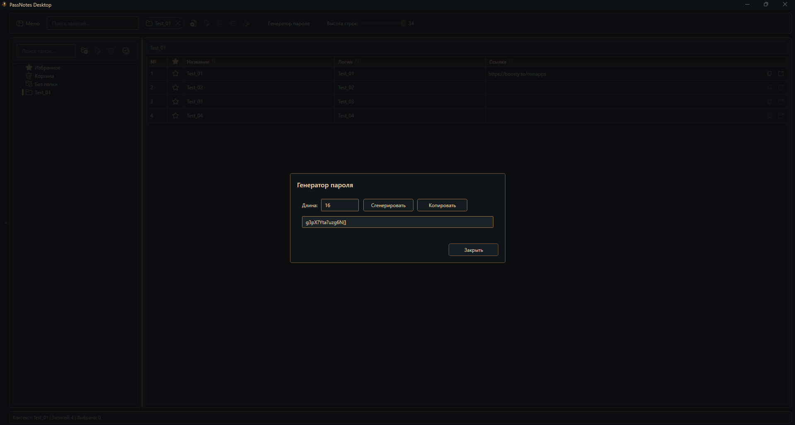
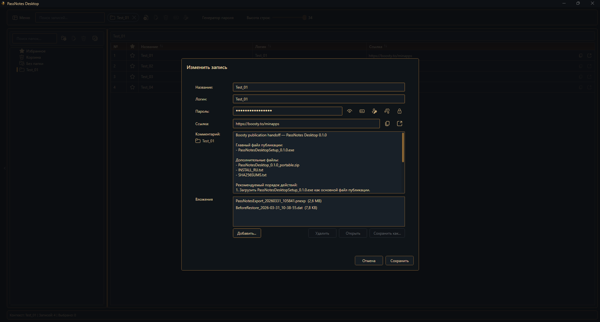
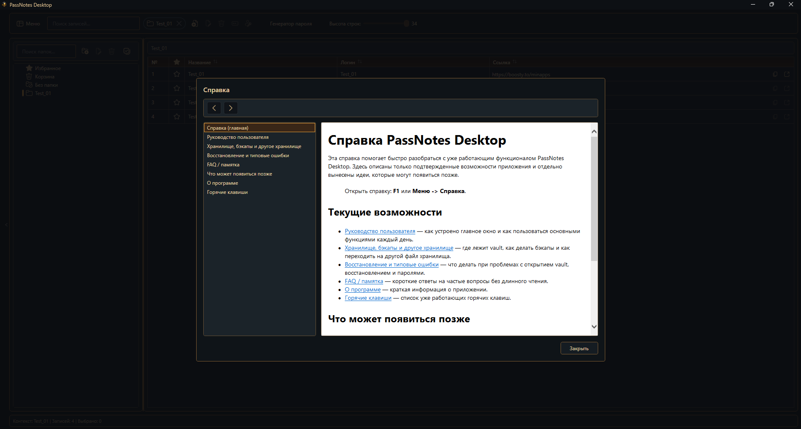
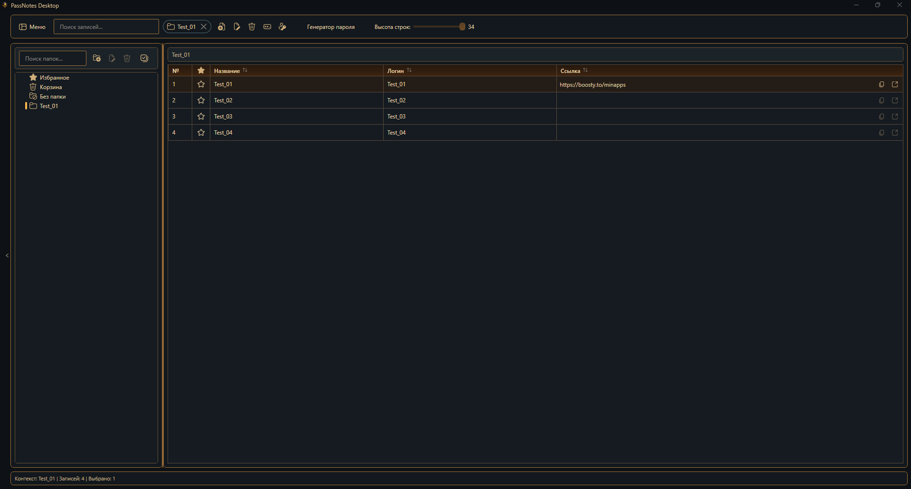
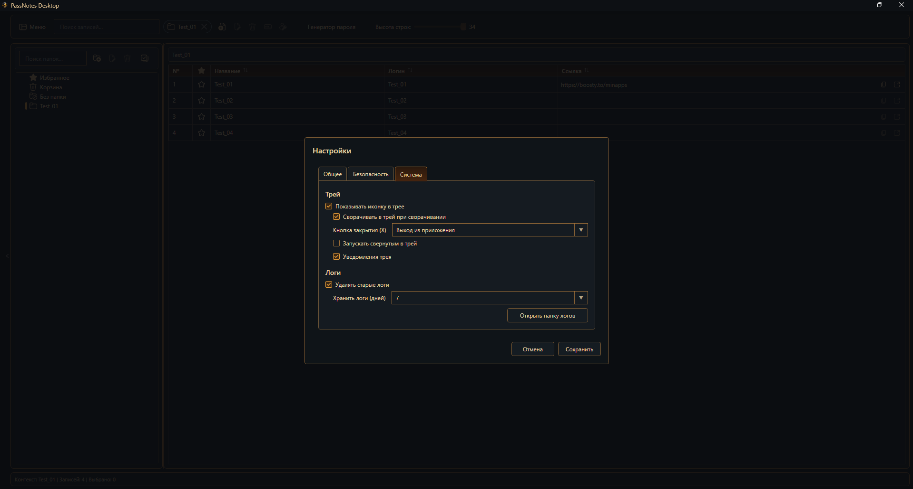

# PassNotes Desktop

PassNotes Desktop is a local Windows app for storing passwords, notes, comments, and attachments in an encrypted vault. It is built with WPF/.NET and aims to keep everyday desktop workflows practical without sacrificing local-first security.

## Why PassNotes

- Local-first by default: data stays on your machine.
- Encrypted storage: vault data is protected with a master password.
- Safe data flows: backups, import, and export are designed around encrypted formats.
- Practical desktop UX: folders, search, multi-select, drag and drop, tray integration, built-in help, and runtime themes.

## Core capabilities

- encrypted vault for passwords and notes;
- folders and entries with comments and metadata;
- encrypted attachments stored alongside the vault in a vault-specific sidecar folder;
- backup and restore flows that account for attachment integrity;
- secure import and export with `.pnexp`;
- built-in RU/EN help content;
- tray support, hotkeys, search, and multi-select workflows;
- multiple runtime themes for the app-owned WPF UI.

## Screenshots

Main window



Edit entry dialog



Built-in help



General settings



Password generator



## Security and data model

- By default, application data is stored under `%APPDATA%\PassNotes`.
- Vault encryption uses `AES-GCM` with `PBKDF2-SHA256`.
- Supported export and backup flows do not rely on plaintext JSON.
- Attachments are handled in an encrypted form and are saved atomically with entry changes.
- PassNotes Desktop is a local desktop app. It does not provide built-in cloud sync.

## Who this project is for

- Windows users who want a local-first password and notes manager.
- People who prefer explicit control over where their data lives.
- Reviewers, employers, or contributors who want to inspect a real WPF/.NET desktop project with a security-focused scope.

## Requirements

- Windows 10 or Windows 11
- .NET 8 SDK
- Optional: Visual Studio 2022 for a full IDE workflow

## Build from source

```powershell
dotnet restore .\PassNotes.csproj
dotnet build .\PassNotes.csproj -c Debug
```

## Run from source

```powershell
dotnet run --project .\PassNotes.csproj
```

Windows convenience launcher:

- `RunPassNotes.vbs` can be started from the repository root.
- It is a local development launcher for this repo snapshot.
- It is not a packaged release launcher.

## Create a release publish folder

```powershell
dotnet publish .\PassNotes.csproj -c Release -r win-x64 --self-contained true -o .\artifacts\publish\win-x64
```

Notes:

- `artifacts/` is a local output folder and is ignored by Git.
- The current working tree includes an installer build route based on `Inno Setup`.
- The repeatable installer command is:

```powershell
.\build\build-installer.ps1
```

- The script creates a self-contained `win-x64` publish folder and then builds the installer into `artifacts\installer\`.
- The repeatable Boosty-ready distribution command is:

```powershell
.\build\build-distribution.ps1
```

- The distribution script rebuilds the publish/installer artifacts and then creates `artifacts\distribution\` with:
  - `PassNotesDesktopSetup_<version>.exe`
  - `PassNotesDesktop_<version>_portable.zip`
  - `INSTALL_RU.txt`
  - `SHA256SUMS.txt`
  - `BOOSTY_POST_RU.txt`
  - `BOOSTY_HANDOFF_RU.txt`
- Code signing is not included in the current route yet.

## Repository layout

- `PassNotes.csproj` — main WPF project file
- `assets/screenshots/` — public UI screenshots used by the GitHub README
- `Themes/` — runtime theme dictionaries and shared baseline resources
- `Resources/` — strings, icons, support assets, app icon assets
- `docs/help/` — user-facing RU/EN help content bundled with the app
- `docs/RELEASE_CHECKLIST.md` — maintainer release/publish checklist
- `docs/RELEASE_NOTES.md` — current release summary

Some files in `docs/` are maintainer-facing planning and status documents. They are kept intentionally for project tracking, but they are not required to build or use the app.

## Current limitations

- No built-in cloud sync
- No plaintext JSON export
- Installer/distribution route is currently unsigned, so Windows SmartScreen may warn on first run
- Version-to-version upgrade verification is still a separate next step
- Windows-only target because this is a WPF desktop app

## Roadmap focus

- version-to-version upgrade verification and code-signing decisions;
- continued release hardening and packaging cleanup;
- further polish of the current desktop UX and documentation.

## License

This repository is licensed under the MIT License. See [LICENSE](LICENSE).
